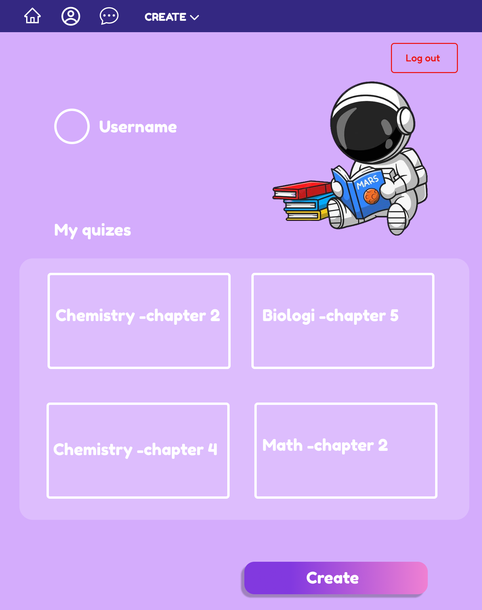
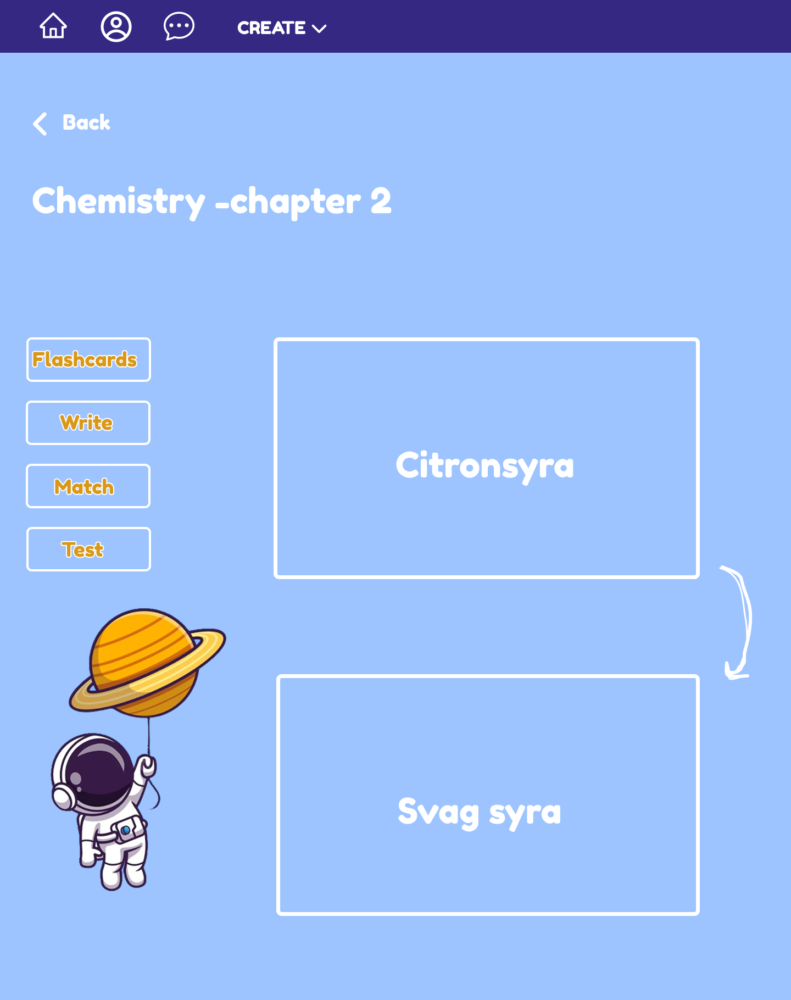

# 🎓 Quiz App – Secure Learning Platform

A fullstack educational tool that allows users to take quizzes, track progress, and log in securely using Google or Facebook. Built with a focus on clean UI, secure architecture, and smooth user experience.

---

## 🔍 Overview

This app lets users:
- Register and log in via OAuth (Google/Facebook)
- Take quizzes with instant feedback
- Save results and revisit progress
- Enjoy a clean, accessible interface designed in Figma

---

## 🔐 Authentication & Session Handling

- 🔒 Register with email and password
- 🔑 OAuth 2.0 login with Google and Facebook
- 🍪 Cookie-based session management with secure tokens
- 🔐 Protected routes for quiz and dashboard access

---

## 📊 Dashboard

The user dashboard shows:
- Completed quizzes
- Scores and progress tracking
- Quick access to retry or review

---

## 🧠 What I Learned

- How to implement both email/password and OAuth authentication
- Securely managing sessions with cookies and JWT
- Building modular REST APIs with Express
- Designing and translating Figma UI into code with Tailwind
- Balancing user experience with security best practices
- I’m proud of how I built a flexible button component using variants – making the UI consistent and maintainable with just one reusable CTA button across the app.

---

## 🛠 Tech Stack

**Frontend:** React · Redux · TypeScript · Styled Components  
**Backend:** Node.js · Express · Mongoose ·  MongoDB  
**Auth:** OAuth2 (Google/Facebook) · JWT · Cookies
**Design:** Figma  
**Hosting:** Coming soon

---

## ✨ Status

Currently being rebuilt and redesigned – live demo coming soon!

---

## 📸 Screenshots / Design

### 🧩 Quiz Login Dialog

### 🧩 Quiz Profile Page

### 📊 Game Dashboard

---

## 🤝 Want to Collaborate?

Feel free to reach out or open an issue if you want to contribute, ask a question, or just say hi!

